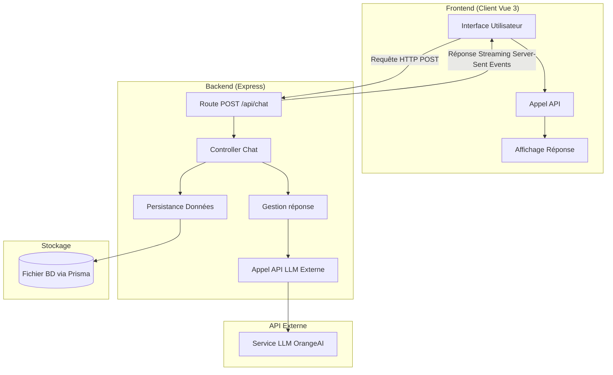
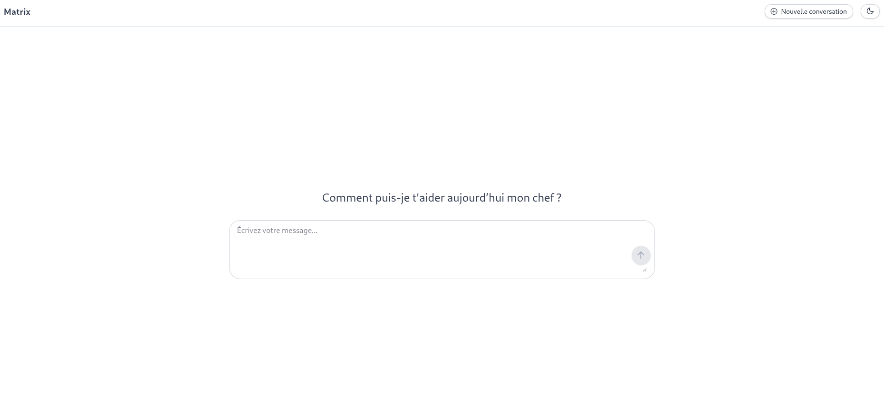

# Matrix

Matrix est un **chatbot open source** développé pour **l'ENSEEIHT INP**.

Ce projet est basé sur une architecture client-serveur.



Matrix intègre:

- **Real-time conversation streaming**
- **Dark mode and responsive UI**
- **Markdown formatting** for messages

## 

## 🛠️ Stack

**Backend:**

- Node.js + Express - Serveur API
- **Prisma** responsable de la conservation des historiques de conversations.

**Frontend:**

- **Vue 3** Pour l'UI
- **\*Tailwind CSS** - Framework CSS utilitaire
- **shadCN** - Composants UI

**Package Manager:**

- **Bun**

---

## 💻 Démarrage Rapide (Development)

Le projet est fonctionnel en développement mais n'est pas encore déployé en production (d'où la présence des fichiers Docker).

### 1. Cloner le dépôt

```bash
git clone https://github.com/your-username/matrix.git
cd matrix
```

### 2. Configuration de l'environnement

```bash
# Dans le dossier server
cd packages/server
cp .env.example .env
```

Éditez le fichier .env pour ajouter votre clé API :

```txt
DATABASE_URL="votre_url_de_base_de_données"
API_KEY="votre_clé_api_ici"
PORT=3000
```

### 3. Installer les dépendances

```bash
# Installer les dépendances globales (à la racine)
bun install

# Ou dans chaque package séparément
cd packages/server && bun install
cd packages/client && bun install
```

### 4. Lancer le serveur de développement

**Backend**

```bash
cd packages/server
bun run dev
```

**Frontend**

```bash
cd packages/client
bun run dev
```
